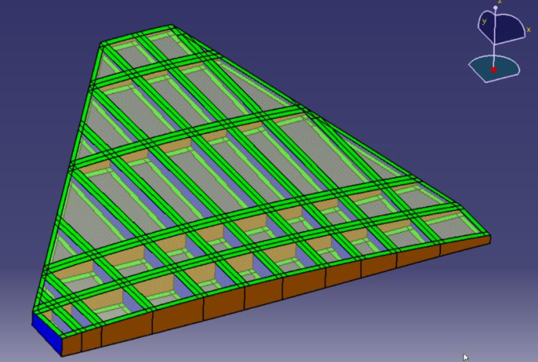
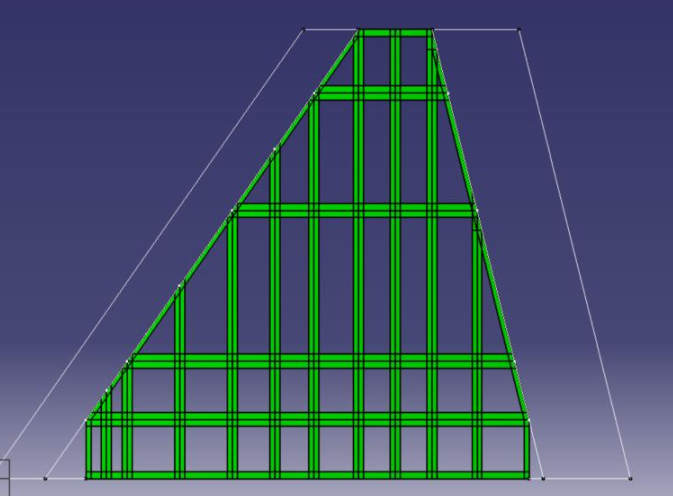

# 🪽 Structural Design of a Multi-Spar Aircraft Wing (Bachelor Thesis)

This project is part of my undergraduate thesis at the **Department of Aerospace Engineering, Institut Teknologi Bandung (ITB)**. The study focuses on the structural design and finite element analysis (FEA) of a **conventional composite multi-spar wing** structure, with application to fighter aircraft.

---

## 📘 Project Summary

The goal of this project was to explore the use of **quasi-isotropic composite materials** to replace metallic structures in high-load wing applications. The wing was designed using **CATIA**, analyzed using **Patran/Nastran**, and optimized through parametric studies involving multiple loading cases.

The structural configuration adopted a **multi-spar** layout due to its advantages in weight distribution and stiffness under supersonic flight loads.

---

## 🛠️ Tools and Methods

- **CAD Modeling**: CATIA V5R19
- **FEA & Meshing**: MSC Patran/Nastran
- **Failure Criterion**: Maximum Strain Theory
- **Material**: G40-800 Carbon Fiber with epoxy resin 5276-1
- **Layup**: Quasi-isotropic `[0/45/-45/90]s`

---

## 📐 Key Design Features

- Detailed right-wing section modeling for symmetry
- Laminate optimization based on multiple spanwise loading profiles:
  - Constant Load
  - Schrenk Distribution
  - Triangular Load
- Component-wise thickness optimization to reduce structural mass

---

## 📊 Analysis & Results

- **Initial Mass**: 1175 kg
- **Optimized Mass**: As low as 539.7 kg
- **Maximum Failure Index** (All < 1.0 after optimization)
- Comparison with anisogrid wing shows up to **30% reduction in structural mass**

---

## 🖼️ Visual Previews

   
  <em>Figure 1: Wing planform with internal multi-spar layout</em>

   
  <em>Figure 2: Internal composite rib-spar-skin arrangement</em>

   
  <em>Figure 3: Full 3D model with skin overlay</em>

   
  <em>Figure 4: FEA stress and failure index result (Patran/Nastran)</em>

---

## 📁 Files Included

- `images/`: Screenshots and visual results

---

## 📌 Citation

**Title**: *Structural Analysis and Design of Conventional Composite Multi-Spar Aircraft Wing Using Finite Element Method*  
**Author**: Bakti Wiryawan Prasasto  
**Institution**: Institut Teknologi Bandung, 2018

---

## 🏁 Conclusion

This project demonstrates the feasibility of composite structures for high-performance wing designs. The final design met safety criteria while achieving **substantial weight savings** over traditional and anisogrid designs.

---

## 📫 Contact

Feel free to reach out for questions, discussions, or collaborations:
- Email: baktiwiryawan@gmail.com
- GitHub: [@bwpras](https://github.com/bwpras)

