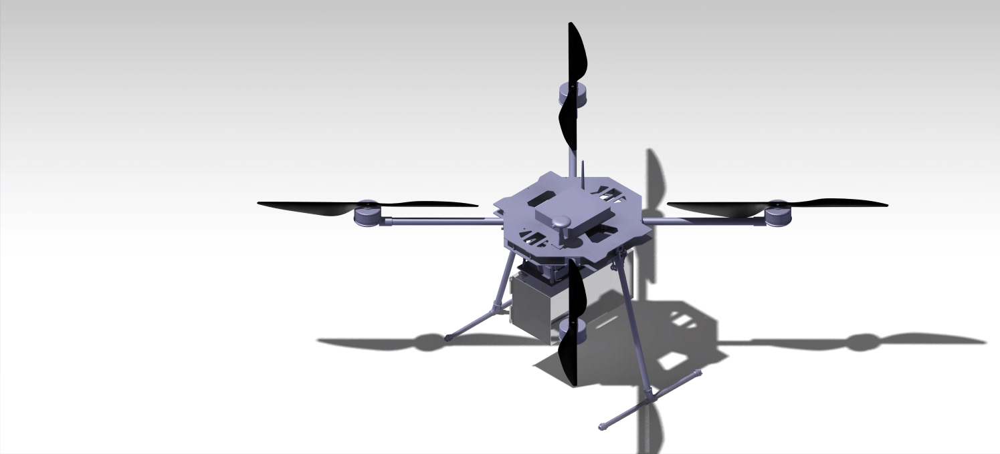

# 🚁 Structural Design of Heavy-Lift Multicopter

This project presents a frame design for a heavy-lift multi-rotor drone. The frame is intended to withstand the vibration and forces of multiple high-thrust motors while keeping the structure lightweight.

## 🔍 Highlights

- Carbon fiber arm supports
- Vibration-damping central mount
- Designed for battery integration and payload isolation

## 🛠️ Tools Used

- Solidworks

## 🖼️ Preview

  <em>Figure 1: 3D model of a multicopter.</em>

  <em>Figure 2: Three view drawing of multicopter.</em>

