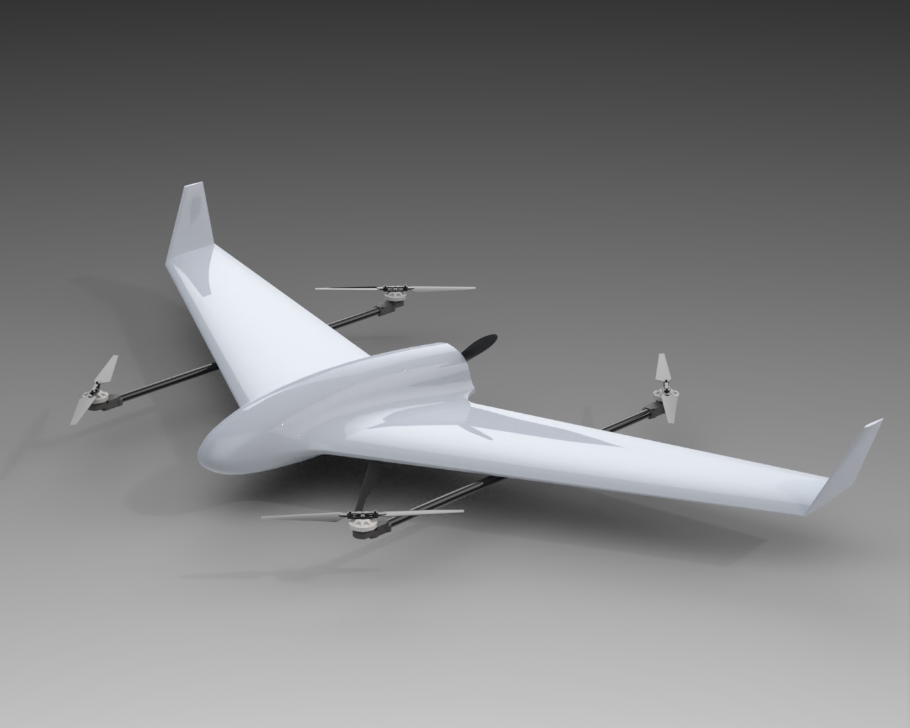
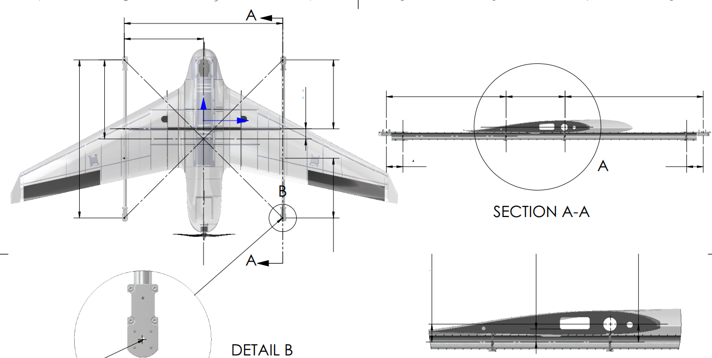

# 🛩️ Structural Design of a Small Unmanned Aircraft

This project involves the design and structural analysis of a small fixed-wing UAV. The design emphasizes weight reduction while maintaining rigidity and modularity for electronics integration.

## 📐 Key Features

- Rib and spar wing structure
- Detachable wing sections
- Designed for lightweight materials (e.g., glass fiber, carbon rods)
- Payload bay included in central fuselage

## 🛠️ Tools Used

- SolidWorks (3D modeling)
- ANSYS (basic load simulation)

## 🖼️ Preview

  <em>Figure 1: 3D model of a fixed-wing UAV - last iteration.</em>

  <em>Figure 2: the first version of assembly drawing of the 3D model.</em>

## 📁 Files Included

- Screenshots and sketches
